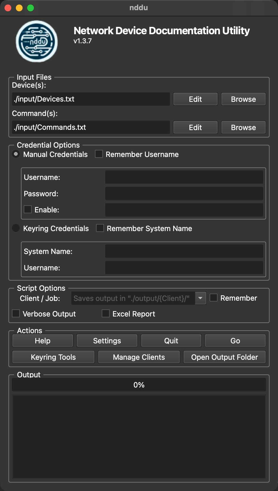
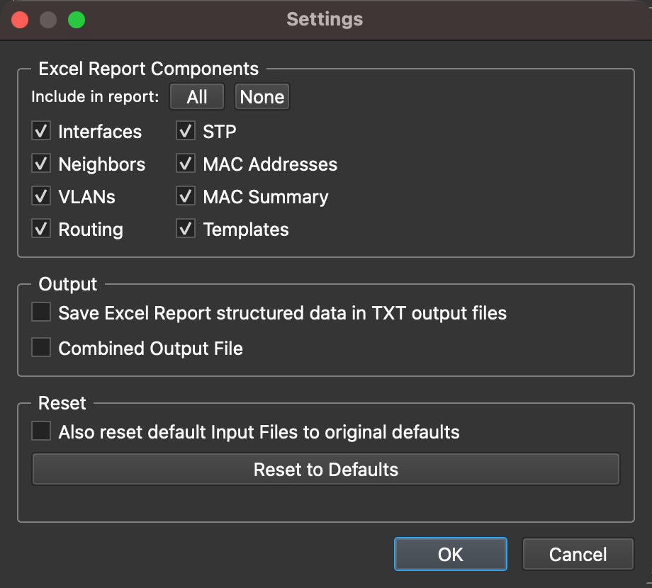

# Network Device Documentation Utility


<!--  -->
<!--  -->


---

**nddu** (Network Device Documentation Utility) is a Python-based tool designed to automate the documentation of network devices using "show" commands. It processes a list of devices and commands concurrently, making it efficient for large-scale network environments.

---

## Screenshots

| Main Application | Settings | Keyring Tools |
| :---: | :---: | :---: |
|  |  |  |

---

## Features

- **Concurrent Processing:** Uses multi-threading to execute commands on multiple devices simultaneously.
- **Customizable Input:** Supports custom device lists and command lists with a built-in file editor.
- **Excel Report:** Generates structured Excel workbooks with selectable report sections (Interfaces, Neighbors, VLANs, Routing, STP, MAC Addresses, MAC Summary, Templates).
- **Device Diff:** Compare two prior runs for the same client and generate a color-coded Excel diff report highlighting added, removed, and changed entries across 10 sheets. Supports optional port map CSV for switch replacement scenarios.
- **Client Manager:** Manage client output folders, view run history, open output files, and manage the device type cache.
- **Device Type Cache:** Auto-detected device types are cached per client so subsequent runs skip the slow auto-detection step.
- **In-App Updates:** Checks GitHub for new releases at launch and offers a one-click upgrade. On a git clone the script runs `git pull` and restarts itself; on other installs it opens the release page in your browser.
- **Verbose Logging:** Includes a verbose mode for detailed debugging and logging.
- **Cross-Platform:** Works on Windows, macOS, and Linux.

---

## Installation

### Prerequisites

- Python 3.8 or higher
- Required Python packages:
  - `PySide6` (for the GUI)
  - `netmiko` (for device connectivity)
  - `ntc-templates` (for structured command parsing via TextFSM)
  - `openpyxl` (for Excel report generation)
  - `keyring` (for secure credential storage)
  - `pyperclip` (for clipboard functions)
  - `packaging` (for version checking)
  - `certifi` (for trusted TLS root certificates on the GitHub update check)

### Steps

1. Clone the repository:

    ```bash
    git clone https://github.com/RacerJay/nddu.git
    cd nddu
    ```

2. Install the required Python packages:

    ```bash
    pip install -r requirements.txt
    ```

3. Run the application:

    ```bash
    python nddu.py
    ```

---

## Usage

1. Launch the application:

    ```bash
    python nddu.py
    ```

2. Configure the input files:

    - **Device(s):** A text file containing the IP addresses of the devices.
    - **Command(s):** A text file containing the commands to execute on each device.
    - Use the **Edit** button next to each file to open the built-in file editor.

3. Choose the credential option:

    - **Manual Credentials:** Enter the username and password manually.
    - **Keyring Credentials:** Use credentials stored in the system keyring.

4. (optional) Select **Script Options** for _Verbose Output_ or _Device Type Auto-detection_.

5. (optional) Check **Excel Report** to generate a structured Excel workbook:

    - Choose which report sections to include using the component checkboxes (Interfaces, Neighbors, VLANs, Routing, STP, MAC Addresses, MAC Summary, Templates).
    - Use **Select All** / **Deselect All** for quick toggling. At least one component must be selected.
    - Check **Force Re-detect** to ignore cached device types and re-detect all devices (useful when devices have been replaced or upgraded).

6. Click **Go** to start the process. The progress bar shows completion status and turns green on success, red on failure, or amber if cancelled.

### Client Manager

Access via the **Manage Clients** button in the Actions row. Features include:

- Create, rename, archive, and delete client folders.
- View run history as a collapsible tree with timestamps and output files.
- Open output files and folders directly from the manager.
- **Compare Runs:** Select two prior runs for the same client to generate a Device Diff report. Optionally provide a port map CSV file (see `input/sample_port_map.csv`) to map old interface names to new ones when a switch has been replaced.
- **Device Type Cache:** View and manage cached device type entries per client.

### Updates

About a second after launch, **nddu** queries the GitHub Releases API for the latest published release and compares it against the running version. If a newer release is available, a green "Update available: vX.Y.Z — Click to update" indicator appears in the title bar.

Clicking the indicator runs the appropriate upgrade strategy for your install:

- **git clone** (the recommended install): a confirmation dialog is shown, then the script runs `git fetch --tags --prune` followed by `git pull --ff-only`. On success, **nddu** restarts itself automatically. If `requirements.txt` changed in the new release, the success dialog tells you to run `pip install -r requirements.txt` after the restart.
- **Manual install** (no `.git` directory): the GitHub release page is opened in your browser so you can download the new version manually.

Failed checks are silent (no popup) — the indicator simply does not appear. Diagnostics are written to the log file: a successful check logs `Update check: latest=... current=...` at INFO level; a failed check logs the exception type and message at WARNING level.

---

## File Structure

```[]
nddu/
├── images/                     # Folder for application images (e.g., logo)
├── input/
│   ├── Devices.txt             # Default device list
│   ├── Commands.txt            # Default command list
│   ├── sample_bulk_file.csv    # Bulk change example file for Keyring
│   └── sample_port_map.csv     # Port map example file for Device Diff
├── output/                     # Output folder for logs and results
├── CHANGELOG.md                # The application's documented changes
├── keyring_tools.py            # Keyring Tools script
├── LICENSE                     # License File
├── nddu.py                     # Main script
├── README.md                   # This file
└── requirements.txt            # Python dependencies
```

---

## Keyring Tools

- See the documentation in the GitHub repository [RacerJay / keyring_tools](https://github.com/RacerJay/keyring_tools)

---

## Limitations

- Input Files
  - Blank lines or lines beginning with the `#` character will be ignored.
- Devices.txt
  - Invalid or duplicate IP addresses will be skipped.
- Commands.txt
  - The only acceptable commands must begin with: `dir`, `mor`, `sho`, or `who`, anything else will be skipped.
  - This script will not allow config changes without alteration.
- Credentials
  - The same credentials must be valid for all of the device IPs in the Device(s) list.
    - If different credentials are required for the devices, run the script again separating them out into different Device(s) lists
  - Credential validation is performed on the first reachable IP address.
    - If the credential check fails, the script will halt to prevent the account from being locked out.
  - Credentials can be securely saved in the local OS' credential store by using the Keyring Tools utility.
    - The Keyring Tools utility allows you to `Get`, `Set`, and `Delete` entries in that credential store.
    - The utility also has a bulk process that lets you make many changes at once by importing a CSV file.
  - Privilege Level 15 (Enable Mode) is the minimum requirement for this script to function properly, as it is designed to execute commands that typically require full administrative access.
  - Multi-Factor Authentication (MFA) may limit the ability for the script to function.
    - It would be best to setup an automation service account for this script's execution that does not require MFA.
- Updates
  - The in-app upgrade requires a `.git` directory next to `nddu.py` and `git` on the system `PATH`. Installs that lack either fall back to opening the release page in the browser.
  - The upgrade refuses to run if the working tree has uncommitted changes. Commit, stash, or revert your local edits before clicking Update.
  - The upgrade uses `git pull --ff-only`. If your clone has diverged from `origin` (e.g. local commits, a different tracking branch), the upgrade will report the git error and stop without modifying anything.
  - The update check requires outbound HTTPS to `api.github.com`. Behind a corporate proxy or with SSL inspection enabled, the check may fail silently — no notification will appear even when a new release exists.
  - On macOS, Python installations from python.org do not trust the system root certificates by default. **nddu** uses `certifi`'s CA bundle for the GitHub API call to work around this. If you are running a custom Python build without `certifi`, you may need to run `/Applications/Python\ 3.x/Install\ Certificates.command` once to install the bundle into Python's trust store.

---

## Changelog

All notable changes to this project will be documented in the [CHANGELOG](CHANGELOG.md) file.

---

## License

This project is licensed under the **MIT License**. See the [LICENSE](LICENSE) file for details.

---

## Contributing & Support

Contributions are welcome! For questions or issues, please open an issue or submit a pull request on the GitHub repository [RacerJay / nddu](https://github.com/RacerJay/nddu).

---

## Acknowledgments

- [**PySide6**](https://pypi.org/project/PySide6/): For the GUI framework.
- [**Netmiko**](https://pypi.org/project/netmiko/): For network device connectivity.
- [**NTC-Templates**](https://pypi.org/project/ntc-templates/): For structured command parsing (TextFSM).
- [**openpyxl**](https://pypi.org/project/openpyxl/): For Excel report generation.
- [**Keyring**](https://pypi.org/project/keyring/): For secure credential storage.
- [**Pyperclip**](https://pypi.org/project/pyperclip/): For clipboard functions.
- [**Packaging**](https://pypi.org/project/packaging/): For version comparison.
- [**Certifi**](https://pypi.org/project/certifi/): For trusted TLS root certificates on the GitHub update check.

<!--  -->
&nbsp;&nbsp;&nbsp;&nbsp;&nbsp;&nbsp;
