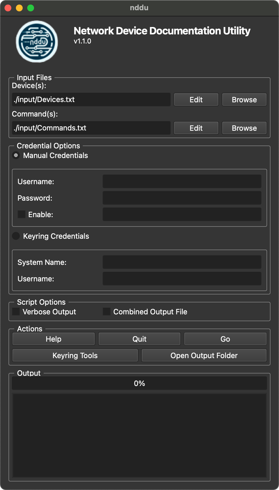
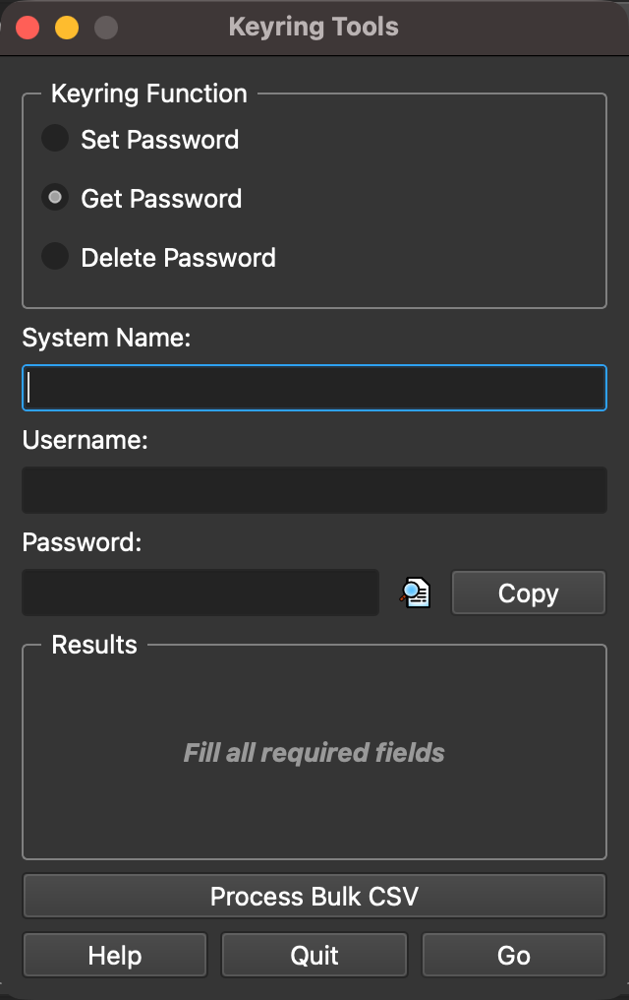

# Network Device Documentation Utility


<!--  -->
<!--  -->


<!--  -->
<!--  -->


**nddu** (Network Device Documentation Utility) is a Python-based tool designed to automate the documentation of network devices using "show" commands. It processes a list of devices and commands concurrently, making it efficient for large-scale network environments.

---

## Features

- **Concurrent Processing:** Uses multi-threading to execute commands on multiple devices simultaneously.
- **Customizable Input:** Supports custom device lists and command lists.
- **GUI and CLI Support:** Provides both a graphical user interface (GUI) and a command-line interface (CLI).
- **Verbose Logging:** Includes a verbose mode for detailed debugging and logging.
- **Cross-Platform:** Works on Windows, macOS, and Linux.

---

## Installation

### Prerequisites

- Python 3.8 or higher
- Required Python packages:
  - `PySide6` (for the GUI)
  - `netmiko` (for device connectivity)
  - `keyring` (for secure credential storage)
  - `pyperclip` (for clipboard functions)
  - `packaging` (for version checking)

### Steps

1. Clone the repository:

    ```bash
    git clone https://github.com/RacerJay/nddu.git
    cd nddu
    ```

2. Install the required Python packages:

    ```bash
    pip install -r requirements.txt
    ```

3. Run the script:
    - **GUI Mode:**

      ```bash
      python nddu.py
      ```

    - **CLI Mode:**

      ```bash
      python nddu.py --cli-mode
      ```

---

## Usage

### GUI Mode

1. Launch the application:

    ```bash
    python nddu.py
    ```

2. Configure the input files:

    - **Device(s):** A text file containing the IP addresses of the devices.
    - **Command(s):** A text file containing the commands to execute on each device.

3. Choose the credential option:

    - **Manual Credentials:** Enter the username and password manually.
    - **Keyring Credentials:** Use credentials stored in the system keyring.

4. (optional) Select **Script Options** for _Verbose Output_, _Device Type Auto-detection_, or _Combined Output File_.

5. Click **Go** to start the process.

### CLI Mode

Run the script with the following options:

```bash
python nddu.py [options]
```

#### CLI Options:

Option(s) | Description
----------|------------
`-h`, `--help` | Show this help message and exit
`-v`, `--version` | Show version information and check for updates
`-cli`, `--cli-mode` | Run in CLI mode (required for CLI mode)
`-d`, `--device-file` | Path to the device list file (default: ./input/Devices.txt)
`-c`, `--command-file` | Path to the command list file (default: ./input/Commands.txt)
`-ks`, `--keyring-system` | Keyring system name for keyring credentials (requires -ku)
`-ku`, `--keyring-user` | Keyring user name for keyring credentials (requires -ks)
`-a`, `--autodetect`    | Enable device type auto-detection
`--verbose` | Enable verbose output
`--combined` | Enable creation of combined output file

#### CLI Behavior:

- The GUI will only start if no arguments are provided.
- The `-v` option will show version information and check for updates.
- The `-cli` option is required for CLI mode.
- If `-ks` or `-ku` are used, both must be provided.
- If neither `-ks` nor `-ku` are used, the script will prompt for credentials.
- If `-d` and `-c` are both used, they will be used as specified.
- If `-d` is used without `-c`, the default command file (`./input/Commands.txt`) will be used.
- If `-c` is used without `-d`, the default device file (`./input/Devices.txt`) will be used.
- If neither `-d` nor `-c` are used, both default input files will be used.

---

## File Structure

```[]
nddu/
├── images/                     # Folder for application images (e.g., logo)
├── input/
│   ├── Devices.txt             # Default device list
│   ├── Commands.txt            # Default command list
│   └── sample_bulk_file.csv    # Bulk change example file for Keyring
├── output/                     # Output folder for logs and results
├── CHANGELOG.md                # The application's documented changes
├── keyring_tools.py            # Keyring Tools script
├── LICENSE                     # License File
├── nddu.py                     # Main script
├── README.md                   # This file
└── requirements.txt            # Python dependencies
```

---

## Keyring Tools

- See the documentation in the GitHub repository [RacerJay / keyring_tools](https://github.com/RacerJay/keyring_tools)

---

## Limitations

- Input Files
  - Blank lines or lines beginning with the `#` character will be ignored.
- Devices.txt
  - Invalid or duplicate IP addresses will be skipped.
- Commands.txt
  - The only acceptable commands must begin with: `dir`, `mor`, `sho`, or `who`, anything else will be skipped.
  - This script will not allow config changes without alteration.
- Credentials
  - The same credentials must be valid for all of the device IPs in the Device(s) list.
    - If different credentials are required for the devices, run the script again separating them out into different Device(s) lists
  - Credential validation is performed on the first reachable IP address.
    - If the credential check fails, the script will halt to prevent the account from being locked out.
  - Credentials can be securely saved in the local OS' credential store by using the Keyring Tools utility.
    - The Keyring Tools utility allows you to `Get`, `Set`, and `Delete` entries in that credential store.
    - The utility also has a bulk process that lets you make many changes at once by importing a CSV file.
  - Privilege Level 15 (Enable Mode) is the minimum requirement for this script to function properly, as it is designed to execute commands that typically require full administrative access.
  - Multi-Factor Authentication (MFA) may limit the ability for the script to function.
    - It would be best to setup an automation service account for this script's execution that does not require MFA.
  - The _Device Type Auto-detection_ script option may significantly slow down the time it takes to discover devices, up to 2 minutes longer per device running in parallel.
    - The script defaults to the Netmiko device type of `cisco_ios`.

---

## Changelog

All notable changes to this project will be documented the [CHANGELOG](CHANGELOG.md) file.

---

## License

This project is licensed under the **MIT License**. See the [LICENSE](LICENSE) file for details.

---

## Contributing & Support

Contributions are welcome! For questions or issues, please open an issue or submit a pull request on the GitHub repository [RacerJay / nddu](https://github.com/RacerJay/nddu).

---

## Acknowledgments

- [**PySide6**](https://pypi.org/project/PySide6/): For the GUI framework.
- [**Netmiko**](https://pypi.org/project/netmiko/): For network device connectivity.
- [**Keyring**](https://pypi.org/project/keyring/): For secure credential storage.
- [**Pyperclip**](https://pypi.org/project/pyperclip/): For clipboard functions.
- [**Packaging**](https://pypi.org/project/packaging/): For version comparison.

<!--  -->
&nbsp;&nbsp;&nbsp;&nbsp;&nbsp;&nbsp;
